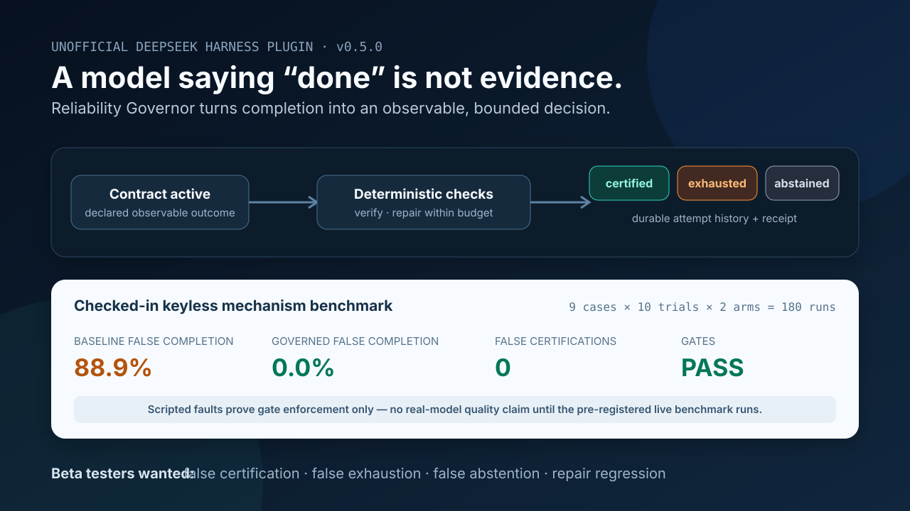

# DeepSeek Harness Reliability Governor

[English](README.md) | [简体中文](README.zh-CN.md)

[](https://github.com/chenjie1129/deepseek-harness-reliability-governor/actions/workflows/ci.yml)

> **非官方社区项目，现招募公开 Beta 测试者。** 请在一次性本地工作区测试 3–5 个任务，并按 [15 分钟反馈协议](FEEDBACK.md) 提交反例。错误认证、正确结果被耗尽、错误放弃、修复导致退化、检查语义过脆和 Harness 兼容问题最有价值。

这是一个可选启用的 DeepSeek Harness 组合包：先让用户审查模型提出的证据合约，再把“模型说做完了”改成“确定性证据检查通过了”。

它**不能让大模型本身变成确定性系统**。它提供的是更窄、可验证的保证：只要可靠性合约仍处于 active 状态，Agent 就不能自然结束；插件会检查证据、引导有限次数修复，最终只记录 `certified`、`exhausted` 或 `abstained`。每次检查和终态都写入持久会话日志，并带内容收据。



## 当前证据状态

| 证据 | 当前结果 | 可以支持的结论 |
| --- | --- | --- |
| 无密钥 Harness AgentLoop 故障矩阵 | 9 个 Case × 10 次重复 × 2 组 = 180 次；机制门禁通过；governed 组 false completion 和 false certification 均为 0 | 在脚本化故障下，active 合约和生命周期能够执行已经声明的确定性检查。 |
| 脚本化辅助作者边界测试 | 严格解析、无工具调用、来源记录和收据绑定均通过 | 只能证明隔离机制，不代表真实模型能写出更好的合约。 |
| A2UI 审批边界测试 | 官方 A2UI v0.9.1 处理器可接受固定界面；批准、修改、拒绝、篡改、回退和无 Provider 路径均 fail closed | 精确提案可在激活前要求 Harness UI 决策；不代表提案本身正确。 |
| 已预注册的供应商模型基准 | 20 个任务 × 5 次重复 × 3 组；尚未运行 | 目前不能声称真实模型质量、时延、成本或净效用已经改善。 |

本项目主动寻找能够推翻当前设计的证据。独立 Oracle 测试方法和隐私要求见 [Beta 反馈协议](FEEDBACK.md)。

## 为什么需要它

随机性不只来自 temperature。工具返回、环境状态、上下文、成功标准不清晰，以及模型“自报完成”都会造成波动。降低 temperature 不能证明事情真的完成；某些推理模式甚至会忽略 temperature。

Harness 已有 goal 和迭代工作流能力，但其当前文档明确没有提供独立验证器。本插件补的是这个通用运行时缺口，不替代原有工作流。

## 提供的能力

- `reliability_assess`：在检查实际结果之前，预览已声明目标的覆盖率、独立证据源数量和脆弱证据警告。
- `reliability_draft`：仅在可选的 `auxiliary-model` 模式中，用一次有边界的纯文本模型调用起草 Claim/Check，并记录来源和收据。
- `reliability_begin`：建立一个明确、持久的完成合约。
- `reliability_begin_code`：建立代码合约，并自动加入部署方要求的全部可信验证 Profile。
- `reliability_verify`：立即运行确定性检查。
- `reliability_status`：读取合约、尝试记录、终态和收据。
- `reliability_abstain`：无法安全证明时明确放弃，不伪造结论。
- `reliability_code_profiles`：列出可信 Profile 元数据，但不向模型暴露可改写的命令。
- `reliability_code_verify`：通过 Harness 托管的 subprocess 和 sandbox 执行固定 Profile。
- `agent/turn-stopping` 门禁：active 合约在 Agent 结束前自动检查；失败时仅引导修复失败项，达到上限后 fail closed。

默认情况下，`reliability_begin` 会在激活前暂停，并显示完整目标、Claim、Check、作者来源、覆盖警告和修复次数。Web 客户端使用固定的 [A2UI v0.9.1](https://a2ui.org/) Basic Catalog 界面；没有该 Renderer 的客户端使用 Harness 原生问答界面显示同一提案。批准与提案收据绑定；要求修改、拒绝、取消、过期动作或 UI Provider 不可用，都不会激活合约。A2UI 只负责呈现，不是审批权威或结果裁判；Harness 的 live-root 用户问答通道记录选择，之后仍由确定性检查决定是否认证。详见[合约审查](docs/CONTRACT_REVIEW.md)。

v0.6 支持 `file_exists`、`file_absent`、`file_contains`、`file_not_contains`、`file_equals`、`json_equals`、`tool_succeeded`、`tool_not_called`、`code_verification_succeeded` 和 `no_tool_errors` 十种检查。

文件验证只通过 Harness 的 `ctx.fs` 做只读检查。可信代码 Profile 的完整 argv 由部署方配置，模型只能提交 Profile ID；执行必须经过 Harness 的 `ctx.subprocess`、`ctx.sandbox` 和 `ctx.sandboxPolicy`。插件不会让大模型担任结果裁判、不会主动重试或切换供应商，也不会自动重复业务副作用。可选的辅助模型只负责发现验收条件，没有认证权。

任何后续的非 Governor 工具调用（包括 Code Mode 内的嵌套调用），以及使用 `workspace-write` 的其他可信 Profile，都会保守地使之前的可信验证结果失效，从而避免“测试通过后又改坏代码”仍被认证。由于 Harness 尚未为任意工具提供权威副作用元数据，即使后续调用实际只读，也需要重新运行可信 Profile。

v0.6 在激活前把每条已声明的成功条件映射到检查，并按独立证据权威而不是检查数量计数：同一个文件上的两个检查只算一个证据源。需要人工判断、当前不支持或独立证据不足的 Claim 会返回 `review-required`；精确字面量、仅存在性和轨迹类检查会给出脆弱性警告。详见[合约覆盖说明](docs/CONTRACT_COVERAGE.md)。这个能力只能检查已声明的 Claim，无法发现模型漏写的需求，也无法证明 Claim 忠实表达了用户意图。

合约作者有三种模式：默认 `current-agent` 不增加模型调用；`auxiliary-model` 通过 Harness 已有的模型路由做一次隔离起草；`manual` 用于用户或已审查的参考合约，但只能诚实记录为“调用方声明”，不能伪装成已认证的人工审批。辅助草稿必须与持久收据完全一致才能激活。详见[合约作者配置](docs/CONTRACT_AUTHORING.md)。

## 安装

在包含本目录的上级目录执行：

```sh
git clone https://github.com/chenjie1129/deepseek-harness-reliability-governor.git
cd deepseek-harness-reliability-governor
npm ci
npm pack
dsh plugin --profile web add ./chenjie1129-dsh-reliability-governor-plugin-0.6.0.tgz
dsh --profile web --dump-config
dsh --profile web
```

Profile 的 `dsh.profile.bundles` 必须真正包含 `@chenjie1129/dsh-reliability-governor-plugin`。只把源码放在 Harness 旁边不算启用。

## 默认配置

```yaml
maxAttempts: 3
maxChecks: 20
maxFileBytes: 1048576
autoVerifyAtTurnStop: true
codeVerificationMaxOutputBytes: 65536
codeVerificationProfiles: []
contractAuthoring:
  mode: current-agent
  maxInputBytes: 32768
  maxOutputTokens: 3000
  timeoutMs: 45000
contractReview:
  mode: required
```

代码 Profile 默认为空，因为不同仓库的测试门禁不同。请按 [可信代码验证](docs/CODE_VERIFICATION.md) 配置经过审查的测试、类型检查和构建命令。内置 Skill 负责教模型如何工作；真正拥有判定权的是固定的运行时 Profile，而不是 Skill。`contractReview.mode: required` 是交互默认值。无人值守评测或自动化必须显式设置 `mode: off`；此时生成未审查的 v3 合约，不能宣称经过用户批准。若启用 `auxiliary-model`，供应商凭据、Endpoint 和模型目录仍在 Harness Models 中配置；Governor 只保存精确的 provider route 和 model ID，不提供自动 fallback。

## 重要边界

- 收据是对日志内容的 SHA-256 摘要，不是数字签名，也不是第三方证明。
- 模型仍负责决定是否建立合约、以及哪些检查能代表成功；错误的合约仍可能验证错误目标。
- 不产生 Harness 工具事件的工作区外部修改无法被检测；生产部署应隔离工作区并禁止并发外部写入。
- 本插件改善结果可靠性，不保证每次回答措辞完全一致。
- UI 批准只表示 live Harness 问答通道接受了这一份精确提案；它不认证法律身份、不证明用户已经理解，也不代表任务已经通过。
- v0.6 不判断视觉质量、超出配置检查范围的开放式语义正确性、被遗漏的 Claim、缺少权威证据的远程状态，也不会猜测未知副作用是否成功；辅助作者和 A2UI 审查都不能突破这些边界。
- 含本插件自定义必要事件的会话，在恢复时应继续安装本组合包。

开发验证：

```sh
npm install
npm run check
npm run benchmark:live:plan
```

`npm run check` 还会执行 180 次真实 Harness AgentLoop 的无密钥 A/B 故障注入基准，其中包含“普通成功工具不能替代可信代码 Profile”的对抗用例。该结果能证明门禁机制和生命周期符合预期，但不能证明自然语言模型本身变成确定性系统。

宣传图由已提交的无密钥报告确定性生成：

```sh
npm run demo:render
```

20 个任务、每组 5 次重复的真实模型三臂预注册协议，会分别报告 false success、false exhaustion、false abstention、合约自编写代价、修复轨迹、独立 Oracle、成本与区间判定；详见 [docs/BENCHMARK.md](docs/BENCHMARK.md)。公开测试方法见 [FEEDBACK.md](FEEDBACK.md)。代码判定边界见 [docs/CODE_VERIFICATION.md](docs/CODE_VERIFICATION.md)。真实 Harness 安装验证步骤见 [docs/SMOKE_TEST.md](docs/SMOKE_TEST.md)。

## 许可证

MIT
