# Contract authoring

Contract authoring, user approval, and outcome judgment are three different jobs. An LLM can help identify what should be checked; it is not trusted to decide whether its own work passed. Reliability Governor v0.6 makes authorship configurable, requires user review by default, and leaves certification in deterministic checks and deployment-controlled verifiers.

## The three modes

| Mode | Extra model call | Intended use | Provenance strength |
| --- | --- | --- | --- |
| `current-agent` (default) | No | Lowest setup and cost; the task agent proposes claims/checks | Caller-declared |
| `auxiliary-model` | One bounded call per draft | A separately routed model proposes the initial contract | Receipt-bound to that exact draft, but not an independent oracle |
| `manual` | No | User or reviewed reference contract | Caller-declared authorship; later UI review is recorded separately |

The authoring default is deliberately zero-configuration and makes no hidden provider request. Independently, `contractReview.mode: required` pauses activation for a Harness UI decision. It does not make the author a separate agent or provider.

## Is the auxiliary author an agent?

No. It is one provider-neutral `ctx.llm.stream` call, not a second Harness Agent:

```mermaid
flowchart LR
  A[Task agent reads task] --> B[reliability_draft]
  B --> C[One text-only model call]
  C --> D[Strict JSON claims and checks]
  D --> E[Deterministic coverage preflight]
  E --> F[Receipt-bound contract]
  F --> R[User reviews exact proposal receipt]
  R --> G[Task and repair loop]
  G --> H[Deterministic or external oracle]
  H --> I[certified / exhausted / abstained]
```



The auxiliary call receives no tool schemas, cannot inspect or mutate the workspace, has no session loop, cannot repair work, and cannot certify. The plugin makes no provider fallback and initiates no retry; exact transport behavior still depends on the selected Harness adapter and its deployment policy.

## Configuration

Provider connections, credentials, endpoints, and catalogs remain in Harness's Models configuration. The governor stores only an exact provider route and model ID:

```yaml
contractAuthoring:
  mode: auxiliary-model
  provider: my-openai-route
  model: gpt-5-mini
  reasoningEffort: low       # optional; must be supported by that exact model
  maxInputBytes: 32768
  maxOutputTokens: 3000
  timeoutMs: 45000
```

There is intentionally no fallback list. A missing route, credential failure, timeout, malformed output, action/tool call, unsupported verifier profile, or non-normal finish fails the draft. It never silently changes provider.

For the default:

```yaml
contractAuthoring:
  mode: current-agent
```

For reviewed, pre-authored contracts:

```yaml
contractAuthoring:
  mode: manual
```

## Auxiliary workflow

1. The task agent performs only the read-only exploration needed to identify paths, constraints, and available evidence.
2. It calls `reliability_draft` with `contract_kind: general` or `contract_kind: code`, the objective, and a concise context summary. For `code`, the runtime deterministically injects every deployment-required trusted verifier profile before calculating the draft receipt.
3. The plugin makes one bounded text-only call and accepts only the documented strict JSON schema.
4. The normal deterministic coverage assessment runs. Human-only, unsupported, or under-supported claims remain `review-required`.
5. A successful draft is written as `reliability/contract-draft` with provider/model/prompt-version provenance, usage when available, and a content receipt.
6. `reliability_begin` accepts a general draft only when `draft_receipt`, objective, claims, and checks exactly match the latest recorded draft. `reliability_begin_code` applies the same rule to code drafts and additionally confirms that every required profile is present. A draft receipt is single-use.

The custom draft event does not contain raw auxiliary reasoning and does not duplicate the supplied context. However, `reliability_draft` is a normal Harness tool call, so its objective and context arguments may already exist in the standard session/tool log. Never place credentials, private source, customer data, or other secrets in `context`.

## What receipt binding proves—and does not prove

Draft receipt binding proves that the proposed contract matches the successful auxiliary draft recorded by this plugin. User approval then produces a version 4 contract that references both the exact proposal and review receipts; draft reuse is rejected. This prevents the task agent from silently changing or replaying the draft between authoring and activation.

It does not prove that:

- the auxiliary model found every requirement;
- the claim wording matches the user's real intent;
- the selected checks are good or independent;
- a human understood or corrected the draft merely because it was displayed;
- the provider signed the output; or
- the outcome passed.

Only later deterministic or external evidence decides the outcome. The default Harness UI review is stronger than caller-declared tool arguments because it is collected through the exact live-root question channel, but it is not a signed identity or comprehension proof. For high-impact work, compare the draft with an independently authored reference and use protected deployment policy where legal identity or dual control is required.

## Evaluation status

The package tests prove isolation, bounds, parsing, allowlisting, durable provenance, and receipt enforcement with a scripted model stream. They do not prove that an auxiliary natural-language model authors better contracts. That requires repeated provider-backed trials against independent task oracles, reporting false certification, false exhaustion, false abstention, omitted claims, latency, and token cost. Until those trials run, `auxiliary-model` is an experimental requirement-discovery option, not a quality claim.
