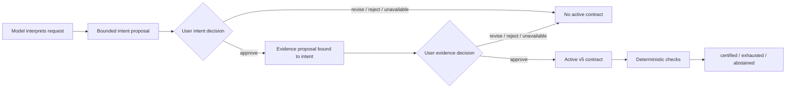

# Two-stage intent and evidence review

Prompt understanding and evidence design are different failure surfaces. A model can build strong checks for the wrong interpretation, while a correct interpretation can still receive weak checks. Reliability Governor v0.7 therefore requires two separate user decisions before an interactive contract activates.

## Plain-language flow

1. The task model performs bounded read-only discovery and expresses its interpretation as an objective, constraints, assumptions, non-goals, and ambiguities.
2. The Governor validates and bounds those fields, hashes the exact proposal, and asks the live root user to approve, revise, or reject it.
3. Only `Approve interpreted intent` proceeds. Every other outcome records a privacy-minimized `reliability/intent-review` event and leaves no active contract.
4. The model also supplies claims, checks, authorship, structural coverage, and a repair budget. An optional auxiliary model may draft only this evidence proposal; it has no approval or certification authority.
5. The Governor binds the evidence proposal to the exact approved intent receipt and asks a second question.
6. Only `Approve exact contract` creates a version 5 contract containing the approved intent plus both review references.
7. Approval still does not mean the task passed. Later deterministic checks produce `certified`, `exhausted`, or `abstained`.



## Does each stage need a model?

The default `current-agent` mode uses the already-running task model to draft both proposals. It makes no extra provider call.

- Intent drafting is semantic work, so a model normally helps express the interpretation. In `manual` mode, a user or reviewed reference supplies it instead.
- Evidence design combines semantic mapping with deterministic structure. The task model drafts it by default; `auxiliary-model` can use one isolated configured provider call for claims and checks.
- Intent validation, receipt calculation, lifecycle enforcement, evidence evaluation, and terminal judgment never require an LLM.
- A second model is optional critique, not an independent oracle. Two models may share the same misunderstanding.

## Intent proposal

The first card contains:

- one concise objective;
- explicit constraints;
- material assumptions;
- explicit non-goals;
- unresolved ambiguities;
- caller-declared authorship; and
- a receipt over the exact normalized content.

All text is bounded. Empty array items, duplicate entries, oversized fields, malformed input, cancellation, stale actions, delegated-agent requests, and missing question providers fail closed.

Approval means only: “this accurately represents the requested outcome closely enough to review an evidence plan.” It is not consent to external side effects and not evidence that the work is complete.

## Evidence proposal

The second card repeats the approved intent dimensions and receipt, then shows the objective, normalized claim mappings, complete check definitions including their parameters, effective repair budget, authorship provenance, coverage summary and receipt, and a new proposal receipt over all proposal fields. It does not hide expected paths or values behind check IDs. Changing the approved intent changes the evidence proposal receipt.

The evidence-review event is version 2 and records the intent proposal receipt. The activated version 5 contract embeds the approved intent content and both review references, making the chain auditable through `reliability_status` and the durable session log.

## What A2UI does

The Web client renders two deterministic A2UI v0.9.1 Basic-catalog surfaces. Both use only `Card`, `Column`, `Row`, `Text`, `TextField`, and `Button`. The decoder accepts only the matching purpose-specific action names, question ID, surface ID, option labels, and proposal receipt.

A2UI remains presentation only. Harness's `ctx.userQuestions` service owns the live-root decision boundary. Delegated child agents cannot ask on the root user's behalf. The server records which presentation was offered; it cannot remotely attest which pixels a capable client rendered. Native Harness question UI remains the fallback.

## Decisions

| Stage | Choice | Result |
| --- | --- | --- |
| Intent | Approve interpreted intent | Allows the bound evidence proposal to be reviewed. |
| Intent | Request intent revision | Returns optional correction text; no evidence review and no contract. |
| Intent | Reject interpretation | No evidence review and no contract. |
| Evidence | Approve exact contract | Activates one version 5 contract containing both approval references. |
| Evidence | Request revision | Returns optional evidence feedback; no contract. |
| Evidence | Reject contract | No contract. |
| Either | Cancel, malformed, stale, unavailable, or renderer error | Fails closed; no contract. |

Free-text feedback is returned to the task agent. Custom review events retain only its byte count and receipt, although ordinary Harness tool events may retain tool arguments and results.

## Configuration

Interactive default:

```yaml
contractReview:
  mode: required
```

This now means both intent and evidence review. There is intentionally no mode that claims intent approval while silently approving evidence, or vice versa.

Explicit unattended mode:

```yaml
contractReview:
  mode: off
```

`off` is intended for pre-registered automation. It creates an unreviewed version 3 contract and makes no human intent or evidence approval claim.

## Security and trust limits

- Review receipts are content hashes, not signatures, identity credentials, or proof of comprehension.
- Intent approval cannot discover an omitted interpretation field or force the user to notice a subtle misunderstanding.
- Evidence approval cannot make weak tests strong or prove that every approved intent dimension was mapped to a claim.
- A malicious same-process plugin remains inside the same trust boundary.
- External, irreversible, or non-idempotent actions still require authoritative policy and action-specific confirmation.
- Do not place secrets in intent fields; they are shown to the user and the approved intent is persisted in a version 5 contract.

## Evaluation boundary

The keyless tests prove two-stage lifecycle ordering, receipt binding, fixed A2UI compatibility, and fail-closed behavior. They do not show that users catch misunderstandings or that two cards improve net task utility. A provider-backed usability arm should pre-register intent correction rate, evidence revision rate, review time, abandoned activations, omitted-requirement detection, false certification, false exhaustion, and downstream task success before claiming benefit.
