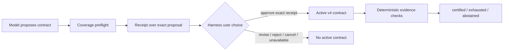

# Contract review with A2UI

The model can help propose what should be examined, but that proposal controls which evidence can later certify success. Reliability Governor therefore makes the proposal a user decision before it becomes an active contract.

## Plain-language flow

1. The task agent proposes the objective, success claims, checks, and repair limit.
2. The governor runs structural coverage checks and calculates a receipt over the exact proposal.
3. Harness pauses the live root agent and asks the user to approve, revise, or reject it.
4. The Web client renders a fixed A2UI v0.9.1 Basic-catalog card. If that client module is unavailable, Harness's native question UI shows the same exact JSON proposal.
5. Only `Approve exact contract` activates the receipt-bound version 4 contract. All other decisions leave no active contract.
6. Approval still does not mean the task passed. Later deterministic checks produce `certified`, `exhausted`, or `abstained`.



## What A2UI does

A2UI is the presentation protocol. The plugin ships one deterministic surface composed only from `Card`, `Column`, `Row`, `Text`, `TextField`, and `Button` in the official Basic catalog. It does not accept model-authored component trees, URLs, arbitrary functions, or arbitrary action names. The envelope is bounded and validated before the A2UI renderer claims the question.

The authority is Harness's `ctx.userQuestions` service, not A2UI. Supplying the calling agent makes Harness accept human interaction only for the exact live runtime root; delegated child agents cannot open this review. The durable `reliability/contract-review` event records the decision, proposal receipt, review receipt, channel, and offered presentation. Free-text revision feedback is returned to the task agent, while the custom review event stores only its byte count and receipt.

The server cannot prove which capable client actually rendered the question, so the record says `a2ui-v0.9.1-with-native-fallback`: it records the presentation offered, not a remote attestation that A2UI pixels were displayed.

## Decisions

| Choice | Result |
| --- | --- |
| Approve exact contract | Activates a version 4 contract containing the proposal and review receipts. |
| Request revision | Returns optional feedback to the agent; no contract activates. |
| Reject contract | Records rejection; no contract activates. |
| Cancel or close | Records cancellation when Harness reports it; no contract activates. |
| Missing provider, malformed answer, stale/tampered action, or renderer error | Fails closed; no contract activates. The native renderer remains available when the custom selector declines malformed A2UI. |

## Configuration

Interactive default:

```yaml
contractReview:
  mode: required
```

Explicit unattended mode:

```yaml
contractReview:
  mode: off
```

`off` is intended for pre-registered automated benchmarks and controlled headless workflows. It creates an unreviewed version 3 contract, makes no user-approval claim, and should be disclosed in evaluation reports. It is not an automatic approval.

## Security and trust limits

- Approval is bound to the proposal receipt; every activation has a unique contract ID, and changing the objective, a check, authorship, coverage assessment, or `maxAttempts` creates a different receipt and requires another decision.
- A receipt is a content hash, not a signature or identity credential.
- The Harness channel proves that the active UI provider answered for the exact live root runtime. It does not establish a legal identity, informed consent, or protection from a malicious same-process plugin.
- User approval does not make weak checks strong, discover an omitted requirement, or certify the outcome.
- A2UI actions return decisions to Harness; they do not directly execute business tools.
- External, irreversible, or non-idempotent repair still requires an authoritative policy, confirmation, or abstention.

## Evaluation boundary

The keyless tests prove message compatibility with the official v0.9.1 processor and fail-closed lifecycle behavior. They do not show that A2UI improves model outcomes or that users catch bad contracts. A provider-backed usability arm should measure approval time, revision rate, omitted-claim detection, post-approval false certification, and user comprehension without changing the pre-registered outcome benchmark after results are seen.
